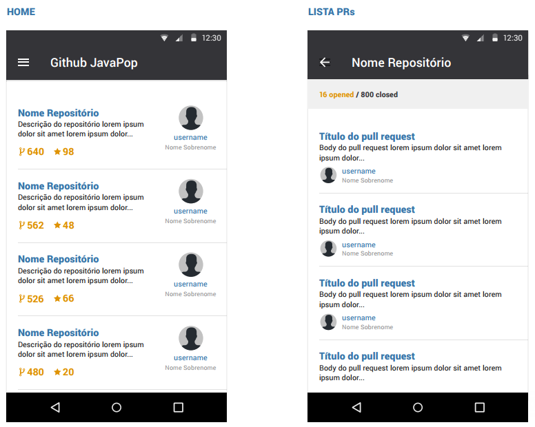

# App for consult the API from GitHub using Android Jetpack Compose

This app was created to study the best practices of technologies for Android.

The idea is consult [API from GitHub](https://developer.github.com/v3/) and get most popular repositories of Java. 

### **Technologies Used** ###

- __MVVM Architecture + Clean__. 
- __Kotlin__. 
- __Hilt__.
- __Coroutines__. 
- __Android Navigation__. 
- __Android Compose__.
- __View State__. 
- __Retrofit 2__.
- __Gson__.
- __Lottie__. 
- __Crashlytics__. 
- __Picasso__. 
- __Pagination__.
- __Modularization__.
- __Unit tests__.
